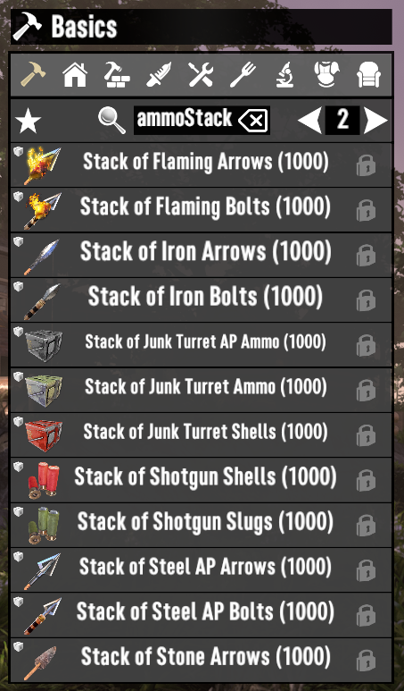

# ISI Template

- Rounded stack sizes up to the next multiple of 10. Minimum of 100.
- Ammo all stacks to 1,000.
- Wood, ores, gas, and construction materials stack to 10,000.
- Added "Stacks of" recipes for clay, sand, cobblestone, cement, and concrete. Unlocks with Art of Mining #5.
- Added "Stacks of" recipes for ammo. Unlocks after completing the relevant book series.
Updated localization.

## Screenshots

